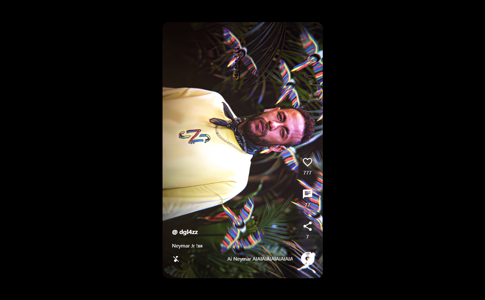

<h1 align="center">
  💻 TIKTOK CLONE
</h1>

<h4 align="center"><a href="https://tiktok-jornada-91755.web.app/">Clique para visitar o projeto</a></h4>

## 📚 Objetivo

- **Tive como objetivo fazer um projeto para visualização de videos tanto pra mobile como para PC que fosse parecido com TikTok. Utilizei nesse projeto o Framwork React do JavaScript e para a integração ao Banco de dados utilizei o Firebase**

- *Construir esse projeto com ajuda da EBAC no evento de uma semana Jornada Dev FullStack!*
---

## 💼 Tecnologias utilizadas

Para o desenvolvimento deste site utilizei as seguintes tecnologias:

- JavaScript;
- HTML
- CSS
- React;
- Firebase;

---

<h2> Autor</h2>

<table>
  <tr>
    <td align="center">
      <a href="https://github.com/Douglasffjw">
         
        
          <b>Douglas Fernandes</b>
        
      </a>
    </td>
  </tr>
</table>
